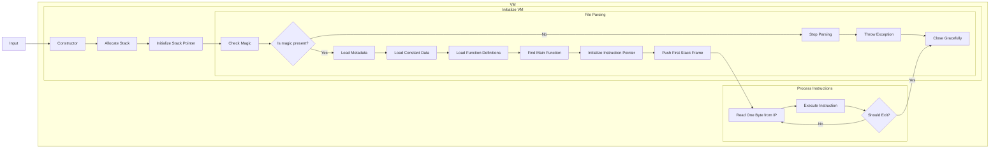

# Architecture

## Virtual Machine

### Pseudo-Registers

```yaml
ip: addr(u1) # The instruction pointer. Holds the addy of the current function.
sp: addr(u1) # Stack pointer.
```

### Runtime



## Name mangling

### Layout

```yaml
helloworld: Function name
(s): Parameter list
V: Return type
```

Thus, `helloworld(s)V` would translate to `void helloworld(string);`

### Types

|  Type  |   Identifier   |
|:------:|:--------------:|
|  Void  |       V        |
| Int32  | I  (Capital i) |
| Int16  |       i        |
| Int64  |       L        |
| Float  |       f        |
| Double |       d        |
|  Char  |       c        |
| String |       s        |
|  Array |      []        |
